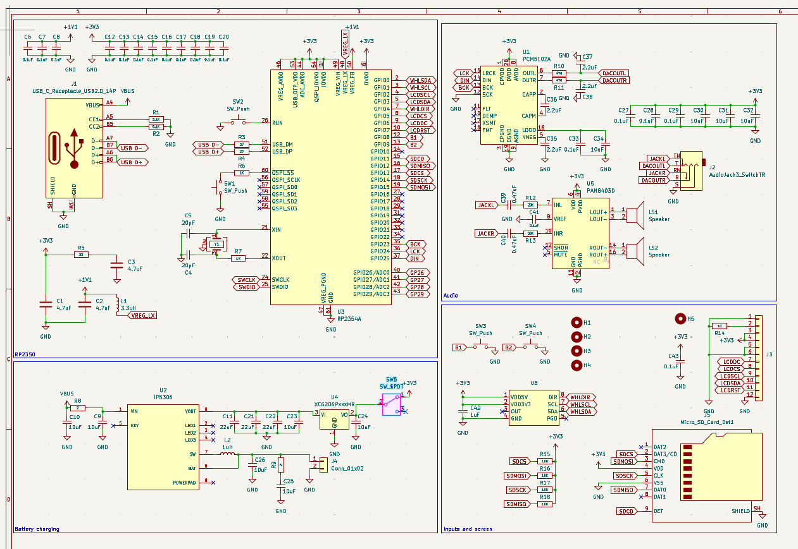
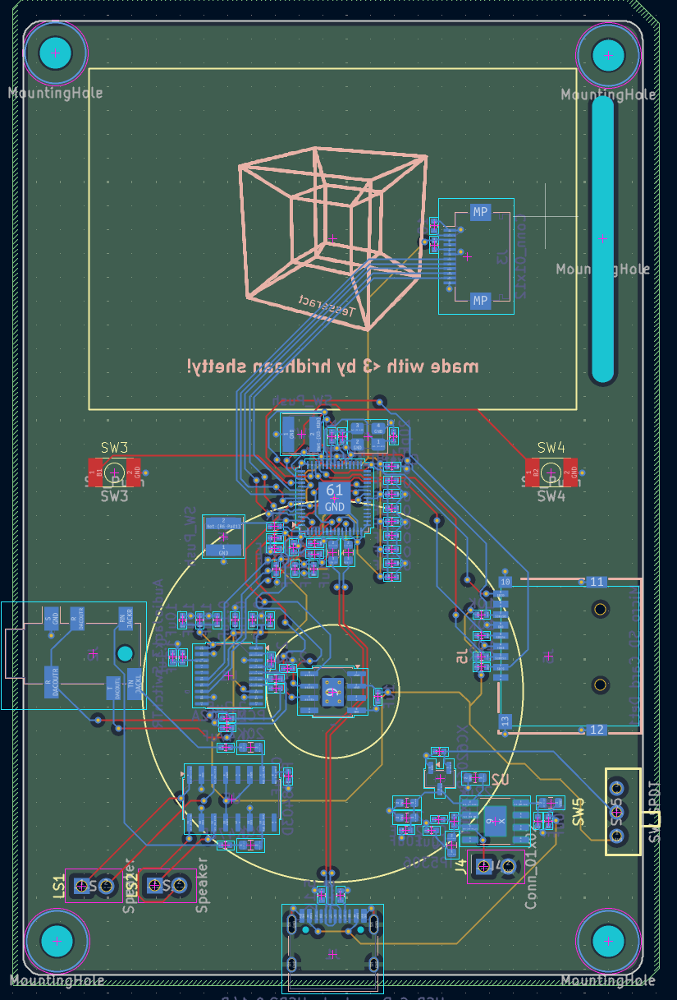
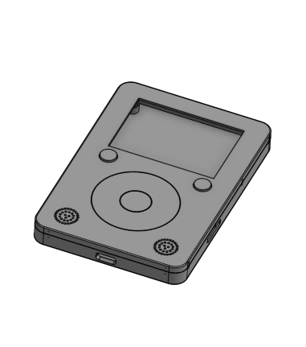

# Tesseract

Tesseract is a retro-style MP3 player with audio output to speakers and headphones, an LCD display, and battery charging for on-the-go listening. 

## Features

- 16-bit 48kHz stereo output to speakers and headphones
- microSD card file loading (up to 32GB)
- 2.0" LCD display (ST7789)
- Battery charging with power path
- Album and artist shuffling modes
- Genre tags

## Pictures

|Schematic|PCB|Case|
|---|---|---|
||||

## BOM

|Part|Quantity|Cost|Link|
|---|---|---|---|
|0402 4.7uF capacitor|3|$0.070|[LCSC](https://www.lcsc.com/product-detail/C23733.html)|
|0402 10uF capacitor|10|$0.258|[LCSC](https://www.lcsc.com/product-detail/C15525.html)|
|0603 22uF capacitor|3|$0.094|[LCSC](https://www.lcsc.com/product-detail/C59461.html)|
|0402 0.1uF capacitor|18|$0.099|[LCSC](https://www.lcsc.com/product-detail/C1525.html)|
|0402 2.2uF capacitor|4|$0.026|[LCSC](https://www.lcsc.com/product-detail/C12530.html)|
|0402 0.47uF capacitor|2|$0.028|[LCSC](https://www.lcsc.com/product-detail/C47339.html)|
|0402 20pF capacitor|2|$0.016|[LCSC](https://www.lcsc.com/product-detail/C1554.html)|
|0402 1uF capacitor|1|$0.012|[LCSC](https://www.lcsc.com/product-detail/C52923.html)|
|microSD card receptacle|1|$0.061|[LCSC](https://www.lcsc.com/product-detail/C7529389.html)|
|0402 3.3uH inductor|1|$0.076|[LCSC](https://www.lcsc.com/product-detail/C48946153.html)|
|0402 1uH inductor|1|$0.035|[LCSC](https://www.lcsc.com/product-detail/C22400378.html)|
|0402 5.1KΩ resistor|2|$0.005|[LCSC](https://www.lcsc.com/product-detail/C25905.html)|
|0402 470Ω resistor|2|$0.010|[LCSC](https://www.lcsc.com/product-detail/C25117.html)|
|0603 20KΩ resistor|2|$0.008|[LCSC](https://www.lcsc.com/product-detail/C4184.html)|
|0402 10Ω resistor|1|$0.003|[LCSC](https://www.lcsc.com/product-detail/C25077.html)|
|0402 10KΩ resistor|4|$0.019|[LCSC](https://www.lcsc.com/product-detail/C25531.html)|
|0603 27Ω resistor|2|$0.007|[LCSC](https://www.lcsc.com/product-detail/C25190.html)|
|0402 33Ω resistor|1|$0.008|[LCSC](https://www.lcsc.com/product-detail/C25105.html)|
|0402 1KΩ resistor|2|$0.008|[LCSC](https://www.lcsc.com/product-detail/C11702.html)|
|0603 2Ω resistor|2|$0.006|[LCSC](https://www.lcsc.com/product-detail/C22977.html)|
|USB-C receptacle|1|$0.172|[LCSC](https://www.lcsc.com/product-detail/C165948.html)|
|12-pin 0.5mm pitch FPC connector|1|$0.088|[LCSC](https://www.lcsc.com/product-detail/C51901313.html)|
|ST7789 12-pin display|1|$4.060|[AliExpress](https://www.aliexpress.us/item/3256810577766519.html)|
|RP2354A|1|$1.318|[LCSC](https://www.lcsc.com/product-detail/C41378174.html)|
|PCM5102A|1|$1.416|[LCSC](https://www.lcsc.com/product-detail/C107671.html)|
|PAM8403D|1|$0.267|[LCSC](https://www.lcsc.com/product-detail/C5122557.html)|
|PJ-242 switching audio jack|1|$0.138|[LCSC](https://www.lcsc.com/product-detail/C431536.html)|
|8Ω 0.5W 20mm speaker|1|$2.690|[AliExpress](https://www.aliexpress.us/item/3256809939513877.html)|
|IP5306|1|$0.299|[LCSC](https://www.lcsc.com/product-detail/C181692.html)|
|XC6206P332MR|1|$0.147|[LCSC](https://www.lcsc.com/product-detail/C5446.html)|
|3.7V 2000mAh lithium polymer battery|1|$6.990|[AliExpress](https://www.aliexpress.us/item/3256802733222186.html)|
|AS5600-ASOT|1|$1.436|[LCSC](https://www.lcsc.com/product-detail/C499458.html)|
|Diametric magnet|1|$0.199|[AliExpress](https://www.aliexpress.us/item/3256810578708839.html)|
|2x1mm neodymium magnets|50|$3.220|[AliExpress](https://www.aliexpress.us/item/3256811645736463.html)|
|12MHz 20pF crystal oscillator|1|$0.096|[LCSC](https://www.lcsc.com/product-detail/C9002.html)|
|3-pin SPDT slide switch|1|$4.950|https://www.aliexpress.us/item/3256809632258636.html|
|PCB|1|$1.400|[JLCPCB](https://cart.jlcpcb.com/quote?stencilLayer=4&stencilWidth=65&stencilLength=100&stencilCounts=5&plateType=1&spm=Jlcpcb.Homepage.1010)|
|Resin printed parts|5|$8.640|[JLC3DP](https://jlc3dp.com/3d-printing-quote?queryMaterialTechnicsId=1)|
|**Total**||$40.166||

## Notes

The PCB is 4 layers (SIG/GND/PWR/SIG).

The firmware is still being developed. I will work on making it better once the device is fully built.

I plan on getting this assembled, hopefully it's not too expensive :(